# Exchatge - a secured message exchanger (desktop client)

The purpose of this project is to easily exchange messages 
via binary protocol using an encrypted communication channel 
in the realtime. Each client-to-server connection is encrypted, 
each client-to-client connection is also encrypted. All messages 
go through server, but because of presence of the second layer 
of encryption between clients, any interception of messages by 
the server or anyone else is useless.

Project is created for Linux x86_64 desktop platforms (PCs).

## `TODO`
* Add file exchanging mechanism,
* Maybe add unit tests,
* Optimize UI for high dpi displays.

## Dependencies

Client side is written entirely in C.

Build is performed via [GNU Make](https://www.gnu.org/software/make) 
with help of [CMake](https://cmake.org) build system generator.

Client side uses the following libraries: 
* [SDL2](https://github.com/libsdl-org/SDL), 
* [SDL2Net](https://github.com/libsdl-org/SDL_net), 
* [LibSodium](https://github.com/jedisct1/libsodium), 
* [Nuklear](https://github.com/Immediate-Mode-UI/Nuklear),
* [SQLite3](https://sqlite.org),
* [GNU C Library (GLIBC)](https://www.gnu.org/software/libc).

## The project is currently in ~~Beta~~ development stage

-- A few more features needed to be implemented:
* File exchange - in process,
* Fetching of messages other users sent to the current while he/she was offline

The implemented features are in beta stage - they work but maybe a little more 
time for testing is worth spending for them.

[The server](https://github.com/vadniks/ExchatgeServer)

## Concept screenshots

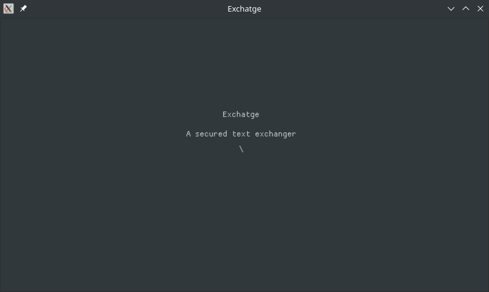
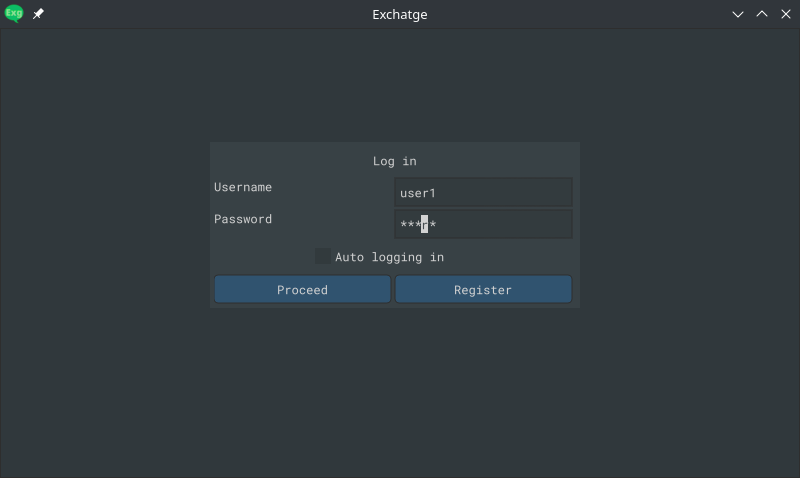
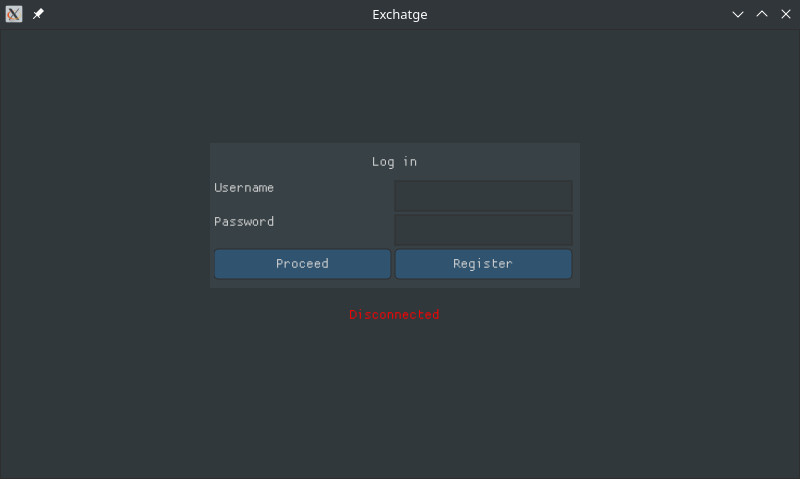
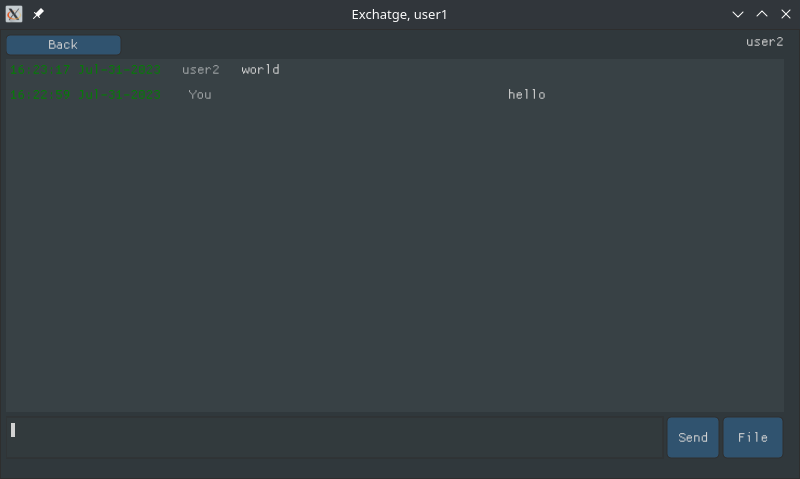
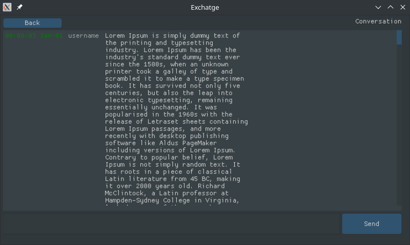
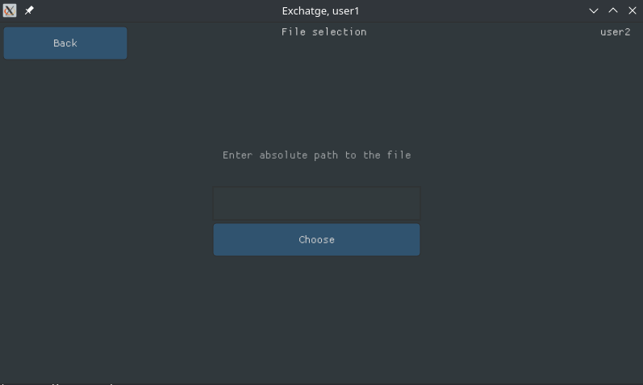
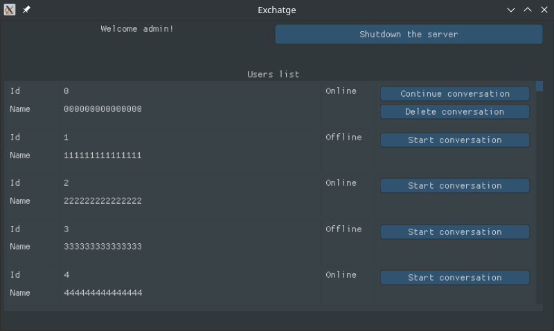
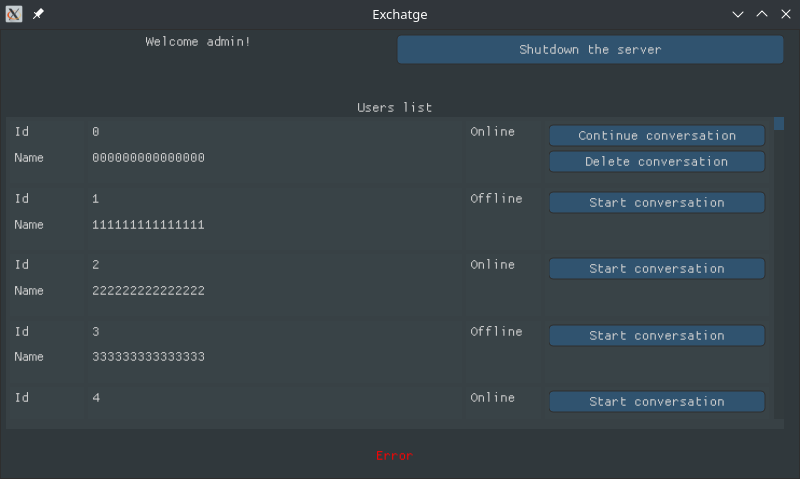
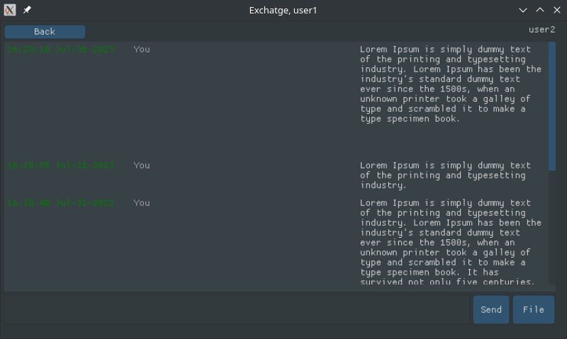
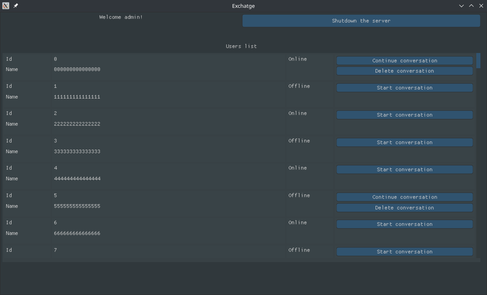
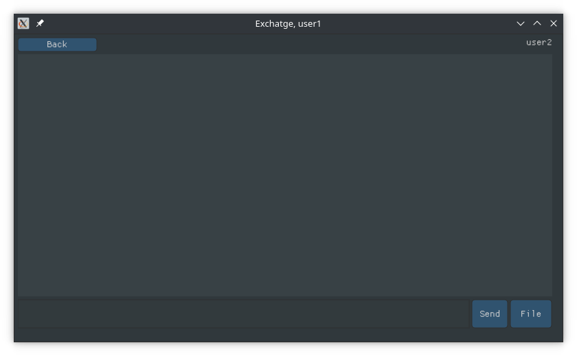
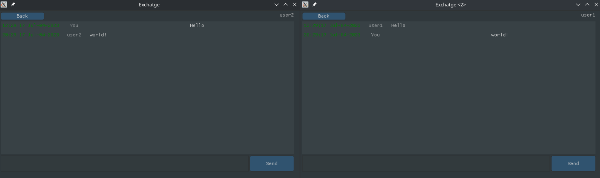

## Build

`TODO`

## License

GNU GPLv3 - to keep the source code open

---

Exchatge - a secured realtime message exchanger (desktop client).
Copyright (C) 2023  Vadim Nikolaev (https://github.com/vadniks)

This program is free software: you can redistribute it and/or modify
it under the terms of the GNU General Public License as published by
the Free Software Foundation, either version 3 of the License, or
(at your option) any later version.

This program is distributed in the hope that it will be useful,
but WITHOUT ANY WARRANTY; without even the implied warranty of
MERCHANTABILITY or FITNESS FOR A PARTICULAR PURPOSE.  See the
GNU General Public License for more details.

You should have received a copy of the GNU General Public License
along with this program.  If not, see <https://www.gnu.org/licenses/>.
