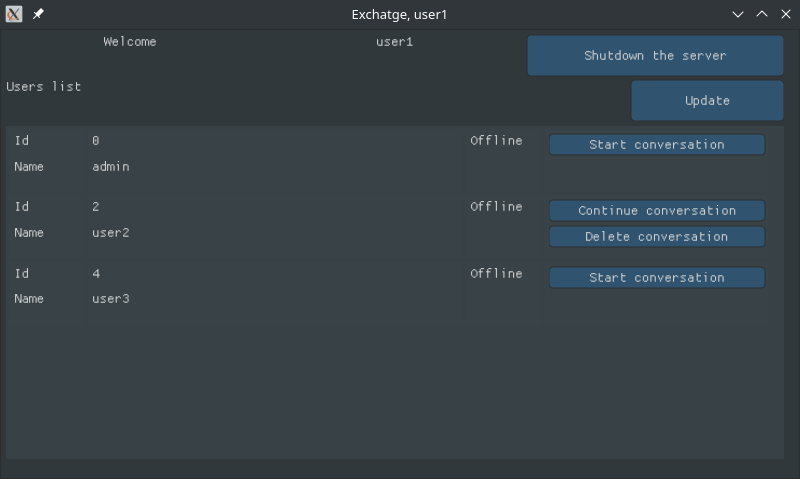
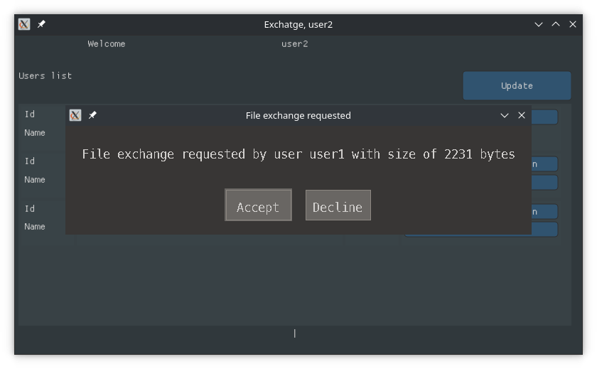
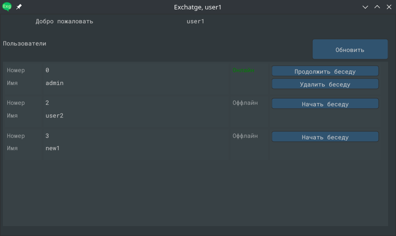

# Exchatge - a secured message exchanger

The purpose of this project is to easily exchange messages using an 
encrypted communication channel in the realtime.

## Dependencies

Client side is written entirely in C with help of 
[CMake](https://cmake.org) build system generator. 
Client side uses the following libraries: 
[SDL2](https://github.com/libsdl-org/SDL), 
[SDL2Net](https://github.com/libsdl-org/SDL_net), 
[LibSodium](https://github.com/jedisct1/libsodium), 
[Nuklear](https://github.com/Immediate-Mode-UI/Nuklear).

## The project is in early development stage

[The server](https://github.com/vadniks/ExchatgeServer)

## Screenshots

