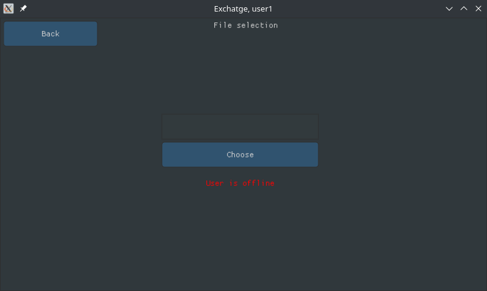
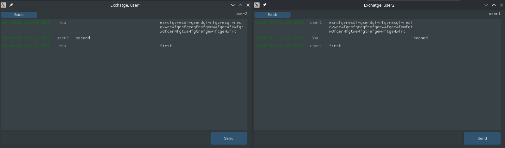
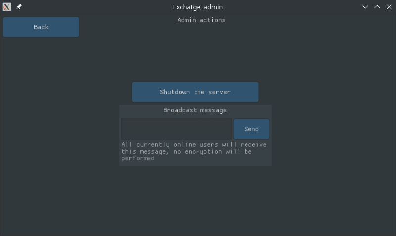

# Exchatge - a secured message exchanger (desktop client)

```
_______ _     _ _______ _     _ _______ _______  ______ _______
|______  \___/  |       |_____| |_____|    |    |  ____ |______
|______ _/   \_ |_____  |     | |     |    |    |_____| |______
```

The purpose of this project is to easily exchange messages 
via binary protocol using an encrypted communication channel 
in the realtime. Each client-to-server connection is encrypted, 
each client-to-client connection is also encrypted. All messages 
go through server, but because of presence of the second layer 
of encryption between clients, any interception of messages by 
the server or anyone else is useless. File exchange is supported.

Project is created for Linux x86_64 desktop platforms (PCs).

## Key features:
* Double end-to-end encryption (each connection between client and server is encrypted, as well as the each conversation channel between 2 clients),
* Encrypted file exchanging via binary protocol,
* Authentication and authorization (each client has login and password, ephemeral token based protection),
* User roles (one admin and $(MAX_USERS_COUNT - 1) users),
* Asynchronous execution,
* Missing messages fetching,
* Graphical user interface,
* Human-readable options file,
* Multiple active simultaneous connections,
* Digital signatures checking between clients and server,
* Broadcasting (only one layer of encryption - between client and server, from admin to all others),
* Instant messages delivery.

## Dependencies

Client side is written entirely in C (C11, with GNU extensions).

Build is performed via [GNU Make](https://www.gnu.org/software/make) 
or via [Ninja](https://ninja-build.org/) 
with help of [CMake](https://cmake.org) build system generator. 
Compilation is performed via [CLang](https://clang.llvm.org/).

Client side uses the following libraries: 
* [SDL2](https://github.com/libsdl-org/SDL); 
* [SDL2Net](https://github.com/libsdl-org/SDL_net); 
* [LibSodium](https://github.com/jedisct1/libsodium); 
* [Nuklear](https://github.com/Immediate-Mode-UI/Nuklear); 
* [SQLite3](https://sqlite.org); 
* [GNU C Library (GLIBC)](https://www.gnu.org/software/libc) - therefore project targets Linux systems. 

## The project is currently in development stage

[The server](https://github.com/vadniks/ExchatgeServer)

## Screenshots









## Build

For convenience, build is performed automatically via shell scripts. 
Execute the following commands to download & build dependencies, 
then, to extract the executable & it's libraries, and finally, to run 
the executable itself:
```shell
chmod +x buildDependencies.sh && ./buildDependencies.sh
mkdir build && (cd build; cmake .. && make)
chmod +x extract.sh && ./extract.sh
LD_LIBRARY_PATH="$(pwd)/extracted" extracted/ExchatgeDesktopClient
```

## Documentation

`TODO`
